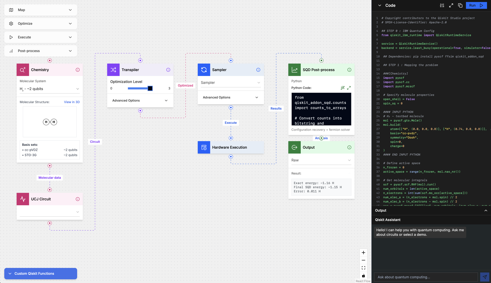

# Qiskit Studio - Visual Quantum Computing Interface [Proof of Concept]

A visual web interface powered by AI for quantum computing development with Qiskit. Build quantum circuits, algorithms, and experiments through an intuitive drag-and-drop interface. This project is part of a set of experiments to generate code using AI tools.



## Overview

Qiskit Studio is a visual quantum computing development environment that bridges the gap between quantum theory and practical implementation. It provides:

- **Visual Circuit Builder**: Drag-and-drop interface for quantum circuit construction
- **AI-Powered Code Generation**: Automatic Python/Qiskit code generation from visual designs
- **Comprehensive Node Library**: 12+ specialized nodes covering all aspects of quantum computing
- **Real Execution**: Integration with IBM Quantum Runtime
- **Educational Focus**: Designed to lower barriers for quantum computing newcomers

## Key Features

### 🎯 **For Newcomers**
- Intuitive visual interface eliminates coding barriers
- Educational node descriptions and examples
- Pre-built quantum algorithm templates
- Interactive learning through hands-on experimentation

### 🚀 **For Experienced Users**
- AI-assisted development environment
- Advanced transpilation and optimization options
- Error mitigation and resilience configuration
- Professional-grade quantum workflow management

### 🧠 **AI Integration**
- Automatic code generation from visual designs
- AI-powered code improvement suggestions
- Context-aware quantum algorithm recommendations
- Natural language to quantum circuit conversion

## Quick Start

### Prerequisites
- [Node.js](https://nodejs.org/) (v18 or higher)
- [uv](https://docs.astral.sh/uv/getting-started/installation/) (for Python dependencies)
- [Ollama](https://ollama.com) (for local LLM support)

### Installation

1. **Clone the repository:**
```bash
git clone https://github.com/AI4quantum/qiskit-studio
cd qiskit-studio
```

2. **Install dependencies:**
```bash
npm install
```

3. **Set up environment:**
```bash
cp .env.local.template .env.local
# Edit .env.local with your configuration
```

4. **Start the development server:**

```bash
npm run dev
```

5. **Setup and start the Maestro workflow API:**


[api/README.md](api/README.md)


6. **Access the web application:**

[`http://localhost:3000`](http://localhost:3000)

### Docker Deployment

For containerized deployment:

```bash
docker build -t qiskit-studio-ui .
docker run -p 3000:3000 --env-file .env.local qiskit-studio-ui:latest
```

## Architecture

### Frontend (Next.js)
- **Framework**: Next.js 14 with TypeScript
- **UI Components**: React + Tailwind CSS + shadcn/ui
- **Flow Engine**: ReactFlow for visual circuit building
- **State Management**: React hooks and context

### Backend (Maestro)
- **AI Pipeline**: Maestro for RAG and code generation
- **LLM Integration**: Ollama with Granite 3.3:8b model
- **Embeddings**: Nomic Text Embeddings
- **Documentation**: Integrated Qiskit documentation search

### Key Components
- **Node System**: 12+ specialized quantum computing nodes
- **Code Generator**: Automatic Python/Qiskit code generation
- **AI Assistant**: Context-aware quantum programming help
- **Runtime Integration**: IBM Quantum Runtime connectivity

## Node Library

See [docs/nodes.md](docs/nodes.md) for detailed documentation of all available nodes.

### Core Nodes
- **Circuit Nodes**: Basic circuit construction and gate operations
- **Execution Nodes**: Quantum hardware and simulator execution
- **Transpiler Nodes**: Circuit optimization and hardware mapping
- **Runtime Nodes**: Error mitigation and resilience configuration
- **Visualization Nodes**: Results display and analysis

## Configuration

### Environment Variables

Create `.env.local` from the template and configure:

```bash
# API Configuration
NEXT_PUBLIC_API_URL=http://127.0.0.1:8000/chat
NEXT_PUBLIC_PARAMETER_UPDATE_API_URL=http://127.0.0.1:8001/chat
```

### LLM Setup

1. **Install Ollama:**
```bash
# macOS
brew install ollama

# Linux
curl -fsSL https://ollama.com/install.sh | sh
```

2. **Download required models:**
```bash
ollama pull granite3.3:8b
ollama pull nomic-text-embed:latest
```

See [CONTRIBUTING.md](CONTRIBUTING.md) for detailed setup and configuration options.

## Usage Guide

### Basic Workflow

1. **Create a New Circuit**: Start with a Circuit Library node
2. **Add Quantum Gates**: Drag gate nodes and connect them
3. **Configure Execution**: Add Runtime or Execution nodes
4. **Visualize Results**: Connect Visualization nodes
5. **Generate Code**: Export Python code for your workflow

### Advanced Features

- **AI Code Generation**: Use Python nodes with AI assistance
- **Error Mitigation**: Configure resilience levels in Runtime nodes
- **Circuit Optimization**: Fine-tune with Transpiler nodes
- **Quantum Chemistry**: Use Chemistry Mapping nodes for molecular simulation

For detailed usage instructions, see [docs/usage.md](docs/usage.md).

## Development

### Project Structure
```
qiskit-studio/
├── app/                 # Next.js app directory
├── components/          # React components
│   ├── nodes/          # Quantum computing nodes
│   └── ui/             # UI components
├── lib/                # Utility functions
├── api/                # API Backend
├── docs/               # Documentation
└── public/             # Static assets
```

### Available Scripts
```bash
npm run dev         # Start development server
npm run build       # Build for production
npm run start       # Start production server
npm run lint        # Run ESLint
```


## Goals and Features

### Core Objectives
- **Qiskit Functions/Patterns/Addons Nodes**: Comprehensive library of quantum computing patterns and standard functions
- **Connection with AI Agents**: Deep integration with AI systems for quantum code generation and optimization
- **Explore Qiskit Demos, Patterns and Code**: Interactive exploration of quantum computing concepts and implementations

## AI Development Assistant Support

This project was co-generated using AI Code assistants. You can use [AGENTS.md](AGENTS.md) to facilitate your code assistant to work with this project:

- **Development Commands**: Complete reference for build, test, and development workflows
- **Architecture Overview**: Key components, node system, and integration patterns
- **Configuration Guide**: Environment setup and API integration
- **Debugging Support**: Troubleshooting AI-powered features and API connections

**Supported AI Assistants:**
- [IBM Bob](https://www.ibm.com/products/bob), Claude Code, GitHub Copilot, Cursor AI, Codeium, Gemini CLI, and other AI development tools

## Contributing

We welcome contributions! See [CONTRIBUTING.md](CONTRIBUTING.md) for:
- Development environment setup
- Code contribution guidelines
- Testing procedures
- Code style standards

## Roadmap

### Current Development
- [ ] Enhanced AI code generation with specialized quantum agents
- [ ] Extended quantum algorithm library with more patterns
- [ ] Advanced visualization and analysis tools
- [ ] Collaborative workspace features


## License

This project is licensed under the Apache License 2.0. See [LICENSE](LICENSE) for details.
